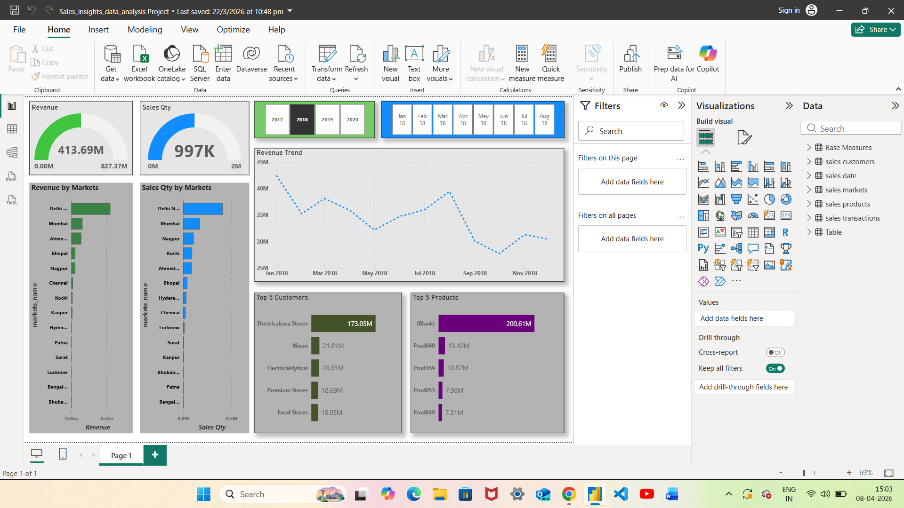
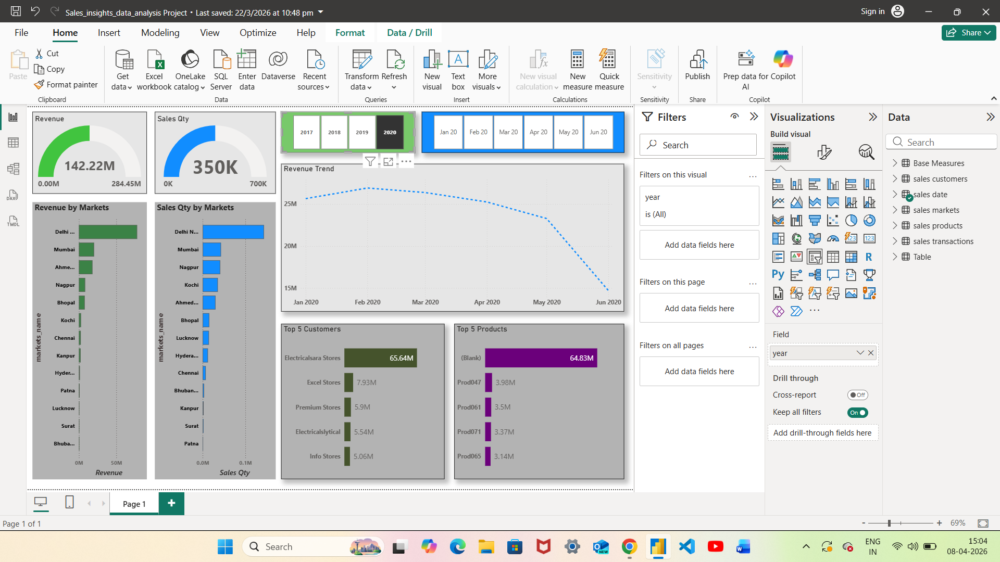

# 📊 Sales Insights Data Analysis Dashboard

## 🔹 Project Overview

This project is a Power BI dashboard built to analyze sales performance across different markets, customers, and products. It provides actionable insights into revenue trends, sales quantity, and top-performing areas to support business decision-making.

---

## 🔹 Objectives

* Analyze overall sales performance
* Track revenue and sales quantity
* Identify top customers and products
* Compare performance across different markets
* Monitor monthly and yearly trends

---

## 🔹 Key Metrics

* **Revenue**: Total sales revenue generated
* **Sales Quantity**: Total number of units sold
* **Revenue by Markets**: Performance across cities
* **Top Customers**: Highest revenue-generating customers
* **Top Products**: Best-selling products

---

## 🔹 Key Features

* 📊 Interactive dashboard with filters (Year, Month)
* 📈 Revenue trend analysis over time
* 🌍 Market-wise sales performance
* 👥 Customer segmentation (Top 5 customers)
* 📦 Product performance analysis (Top 5 products)
* 🔍 Dynamic filtering for better insights

---

## 🔹 Tools & Technologies Used

* Power BI
* SQL / Excel (Data Source)
* DAX (Data Analysis Expressions)
* Data Cleaning & Transformation

---

## 🔹 Dashboard Insights

* Delhi and Mumbai contribute highest revenue
* Sales trend shows fluctuations across months
* Few customers contribute major revenue share (Pareto insight)
* Certain products dominate sales performance
* Year-wise comparison highlights growth patterns

---

## 🔹 Dashboard Screenshots

### 📌 Main Dashboard View





---

## 🔹 Dataset Information

* Customer Data
* Product Data
* Market (City) Data
* Sales Transactions
* Date Table (Year, Month)

---

## 🔹 How to Use

1. Download the `.pbix` file from this repository
2. Open it in Power BI Desktop
3. Use filters (Year, Month) to explore insights

---

## 🔹 Project Structure

```id="5ntd70"
Sales-Insights-Project/
│
├── Sales-Insights.pbix
├── dataset.xlsx / SQL data
├── screenshots/
│   └── dashboard1.png
    └── dashboard2.png
└── README.md
```

---

## 🔹 Future Improvements

* Add profit and cost analysis
* Include forecasting (sales prediction)
* Enhance dashboard design
* Add drill-through analysis

---

## 🔹 Author

**Siril**
Final Year B.Tech (CSE - AI)
Aspiring Data Analyst

---

## 🔹 GitHub Purpose

This project demonstrates data analysis and visualization skills using Power BI and is part of my portfolio for placement opportunities.
